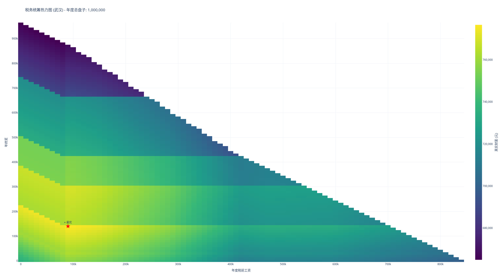

# 中国税务统筹计算器 (2025 Profile 版)



本项目是一个高级税务筹划模拟工具，通过穷举年度工资与年终奖的分配方案，在给定的年度总盘子（Total Pool）下，自动寻找**真实财富最大化**（现金 + 公积金）的最优路径。

## 2025 版重大更新

- **城市配置文件 (Profiles):** 内置北京、上海、武汉的最新社保基数上限、下限及缴费比例。
- **年终奖优惠算法:** 支持年终奖单独计税优惠政策（有效期至 2027 年底），并自动处理“工资未达起征点”时的抵扣转移。
- **财富视角优化:** 优化目标从“税负最低”转为“真实财富最高”（Real Liquid Wealth = 税后现金 + 公积金总额）。
- **企业税费闭环:** 包含企业五险一金成本、企业所得税 (CIT) 及分红税 (Dividend Tax)。

## 快速开始

### 安装依赖

本项目使用 [uv](https://docs.astral.sh/uv/) 作为 Python 包管理工具。

```bash
# 克隆项目后，安装依赖
uv sync
```

### 运行脚本

```bash
# 使用武汉配置文件运行
uv run python tax_optimizer.py --city wuhan --pool 1000000

# 自定义参数：总盘子 200万，专项扣除 3.6万，步长 5000，上海
uv run python tax_optimizer.py -c shanghai -p 2000000 -d 36000 -s 5000
```

## 命令行参数

| 参数 | 短参数 | 默认值 | 说明 |
|------|--------|--------|------|
| `--city` | `-c` | beijing | 城市配置：`beijing`, `shanghai`, `wuhan` |
| `--pool` | `-p` | 1000000 | 企业分配给个人的年度总成本（含五险一金、工资、奖金、分红前利润） |
| `--deduct` | `-d` | 18000 | 个人年度专项附加扣除总额（如租房、子女教育、赡养老人等） |
| `--step` | `-s` | 10000 | 穷举时的计算步长（越小越精确，但计算越慢） |
| `--cit` | 无 | 0.05 | 企业所得税率（0.05 小微, 0.15 高新, 0.25 一般） |
| `--output` | `-o` | tax_optimization_bonus.html | 输出交互式 HTML 热力图文件名 |

## 计算模型说明

### 1. 社保与公积金 (Social Insurance & HPF)
根据不同城市配置自动调整：
- **上限 (Cap):** 2024/2025 城镇职工月缴费基数上限（约 3.5w - 3.7w）。
- **下限 (Floor):** 强制性月缴费基数下限。
- **公积金:** 考虑了不同城市标准比例（如北京 12%，上海 7%）。

### 2. 个人所得税 (IIT)
- **综合所得:** 工资扣除社保、专项附加、6万免税额后按七级累进税率。
- **年终奖:** 采用单独计税优惠政策，使用 `(奖金 / 12)` 找税率。
- **抵扣转移:** 若月工资低于 5000，自动将未用完的免税额度转至年终奖抵扣。

### 3. 企业所得税与分红
- **利润:** `Total Pool - (工资 + 奖金 + 企业缴纳社保)`。
- **分红税:** 利润扣除企业所得税后，按 20% 计征个人股息红利税。

## 已弃用的旧版选项 (Outdated Options)

在 2025 版重构中，以下逻辑已被替换或废弃：
1. **固定 20% 社保比例:** 旧版脚本使用固定的 20% 比例，现已改为根据城市 Profile 动态计算企业+个人各险种比例。
2. **400,000 固定基数上限:** 旧版使用硬编码的 40k 上限，现已更新为各城市官方 2024/2025 最新发布值。
3. **忽略年终奖计算:** 旧版将所有收入视为工资，忽略了年终奖单独计税的节税效应，现已完全支持。
4. **忽略企业所得税:** 早期版本未考虑利润分红路径，现已包含完整的企业-个人财富闭环。

## 城市数据概览 (2025 参考值)

| 城市 | 月缴费上限 | 月缴费下限 | 个人公积金 | 企业社保(约) |
|------|------------|------------|------------|--------------|
| 北京 | 35,283 | 6,821 | 12% | 27.5% |
| 上海 | 36,921 | 7,310 | 7% | 27.16% |
| 武汉 | 34,863 | 7,489 | 12% | 25.72% |

## 注意事项

1. **仅供参考:** 本工具旨在提供数学层面的税务优化视角，不构成法律或专业税务建议。
2. **政策变动:** 社保基数通常在每年 7 月调整，本脚本预置了 2024 年下半年及 2025 年的预测/现行值。
3. **私营/非私营:** 社保比例可能因企业性质（如高新、困难企业减免）有所不同，可在 `tax_optimizer.py` 的 `CityProfile` 中手动微调。

## License

MIT
